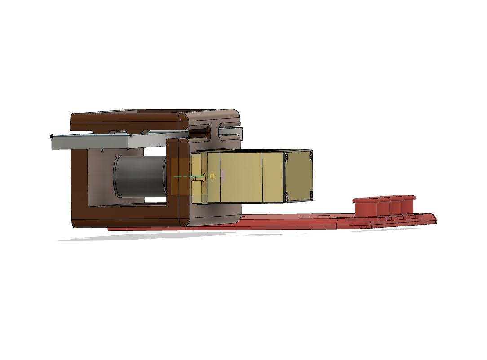
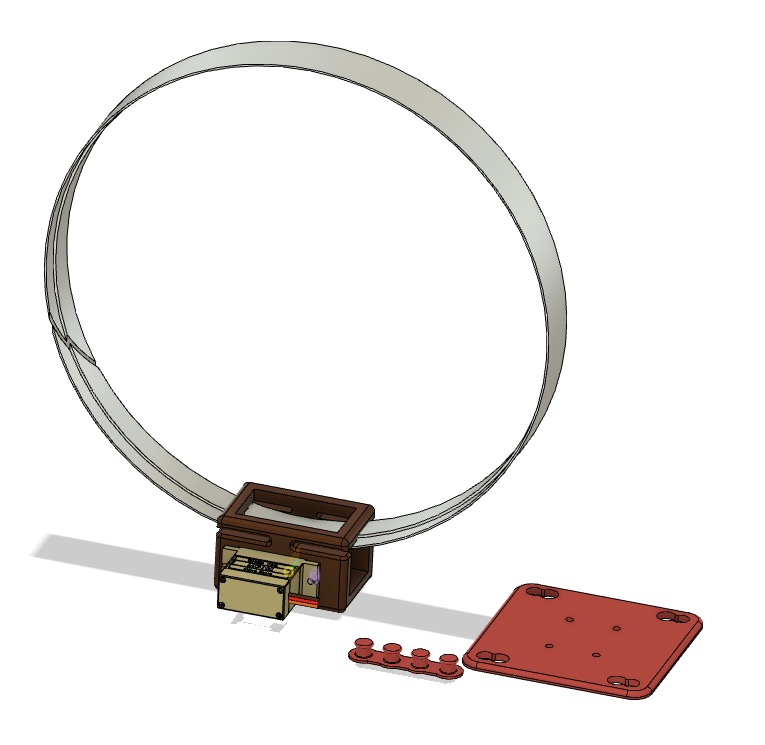
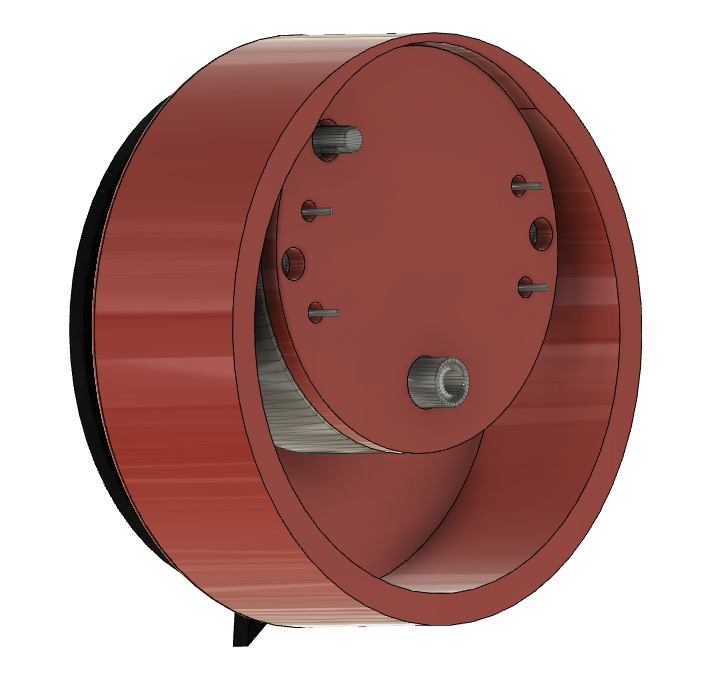

# Kinetic Wearables Toolkit

## Table of contents
* [General info](#general-info)
* [In Use](#in-use)
* [Servo 90 Degree](#servo-90-degree)
* [Servo Flex Base](#servo-flex-base)
* [Servo Linear Adaptor](#servo-linear-adaptor)
* [Micro Stepper Motor](#micro-stepper-motor)
* [Solenoid](#solenoid)
* [BOM](#bill-of-materials)
* [Status](#status)
* [License](#license)
* [Contact](#contact)

## General info
These designs make up a wearable electronics toolkit for electronically animating clothing and accessories using several types of small electric motors for fashion, design and DIY electronics. The toolkit offers several kinds of motion in multiple axes using 3D printed parts and lightweight, inexpensive motor/actuators with multiple attachment options. This toolkit represents the result of our initial work in this area, and provides a basis for building wearable prototypes, finished designs, and for developing further design considerations through experimentation and testing.

## In Use

Above: Some elements of the toolkit. Black arrows illustrate direction of movement.

## Servo 90 Degree

* Using a common 9g micro servo motor
* Pivots in base add support for higher loads
* 3D printable in PLA or other rigid material. We use polycarbonate.
* Attaches with pin/slot or strap

## Servo Flex Base

* 9g micro servo motor is attached using M2 bolts
* 3D printable in TPU or other flexible material. We use Ninjaflex.
* Attaches with pin/slot in a fixed position or can be mounted with a strap

## Servo Flex Tilt Base

* 9g micro servo motor can be installed in multiple orientations, without tools
* 3D printable in TPU or other flexible material. We use Ninjaflex.
* Attaches with pin/slot in a fixed position or can be rotated under a strap.

## Servo Linear Adaptor

* 9g micro servo motor drives a wheel which drives a rail of any length.
* Rail can be curved as shown in first image above
* Rail can be straight as shown in second image above
* Flexible tire is not included in the CAD model above. We used a rubber grommet, e.g. http://en.wikipedia.org/wiki/Image:Rubbergrommets.jpg
* As with Servo Flex Base above, servo can be 180 degree or continuous type motor.
* Linear adaptor is 3D printable in PLA or other rigid material.
* Linear adaptor bolts to flexible base in one of two orientations.
* Base uses pin/slot to attach to fabric.

## Micro Stepper Motor

* Uses small x27.168 stepper motor
* Attaches to cloth using lapel pin (not shown)
* 3D printable in PLA or other rigid material
* Suitable for very light loads only

## Solenoid

* Uses small 5V solenoid (e.g. https://www.digikey.ca/product-detail/en/sparkfun-electronics/ROB-11015/1568-1592-ND/6163694)
* Soloid is press fit in either mount, flat or 90 degree.
* Mount is 3D printable in TPU or other flexible material.
* We recommend 3D printing (FDM) with square aperture of each part facing up to avoid the need for support structures.
* Be mindful of heat buildup if solenoid is energized at a high duty cycle.

## Bill of Materials
This bill of materials is shown in the photo "Complete Toolkit.jpg". The stepper motor can be made to work without the stepper motor driver featherwing shown.

|  **Fabricated parts:** |  |  |  |  |
| --- | --- | --- | --- | --- |
|  Part/Assembly | Qty | Material |  |  |
|  Micro servo flex base | 1 | TPU/Ninjaflex |  |  |
|  Micro servo flex tilt base | 1 | TPU/Ninjaflex |  |  |
|  micro stepper rotobrooch | 1 | PLA |  |  |
|  Servo 90 deg base | 1 | TPU/Ninjaflex |  |  |
|  Solenoid v3 (both parts) | 1 | TPU/Ninjaflex |  |  |
|  Servo linear adaptor | 1 | TPU/Ninjaflex and PLA |  |  |
|  Servo linear rail (various sizes available) | 1 | PLA |  |  |
|   |  |  |  |  |
|   |  |  |  |  |
|  **Purchased parts:** |  |  |  |  |
|   |  |  |  |  |
|  Part | Qty | Price/ea | Supplier | Link |
|  Gauge stepper motors | 1 | $31.99 for 6pcs | Amazon.ca | https://www.amazon.ca/Dromedary-Stepper-Speedometer-Instrument-Cluster/dp/B0759KTMFD/ref=pd_sbs_263_t_0/144-8892975-8369744?_encoding=UTF8&pd_rd_i=B0759KTMFD&pd_rd_r=fdcf2d0b-94cb-46ba-a4cf-2a807ee53c33&pd_rd_w=m43Oy&pd_rd_wg=Zf0XD&pf_rd_p=9926bb69-42b9-46e4-b788-f665992e326d&pf_rd_r=C48209XGPAC0VSNZBS1Z&psc=1&refRID=C48209XGPAC0VSNZBS1Z |
|  Pull solenoid 5V | 1 | $8.95 | Creatron | https://www.creatroninc.com/product/5v-mini-pull-type-solenoid/?search_query=5V+solenoid&results=1 |
|  180 degree servo | 1 | $9.50 |  |  |
|  Full rotation servo | 1 | $10.50 | Creatron | https://www.creatroninc.com/product/full-rotation-micro-servo-motor-15kgcm/ |
|  Motor featherwing | 1 | $35.55 | Creatron | https://www.creatroninc.com/product/4-channel-motor-featherwing-12a/?search_query=TB6612&results=4 |
|  Small stepper motor | 1 | 19.99 | Amazon.ca | https://www.amazon.ca/Degree-Bipolar-Stepper-15-6oz-Printer/dp/B071DD8XT7/ref=pd_sbs_60_2/144-8892975-8369744?_encoding=UTF8&pd_rd_i=B071DD8XT7&pd_rd_r=b4966d28-7fe6-437f-82f2-49fc942c1dc3&pd_rd_w=N2Ol4&pd_rd_wg=IGLQH&pf_rd_p=c7838c3c-6de6-46ad-946c-b7318af714fb&pf_rd_r=GGTRCG404WN1R3AHKCF8&psc=1&refRID=GGTRCG404WN1R3AHKCF8#customerReviews |
|  M2x0.4 bolt x 10mm (SHCS or BHCS) | 8 | $9.95 for kit | amazon.ca | https://www.amazon.ca/dp/B06ZXSPFHR/ref=cm_sw_em_r_mt_dp_U_-gfREbF5NERRE |
|  Rubber grommet |  | $19.39 for kit | amazon.ca | https://www.amazon.ca/dp/B01MU0UN0Y/ref=cm_sw_r_tw_dp_U_x_BkfREb57RG5AE |
|   |  |  |  |  |
|   |  |  |  |  |
|  **Not included (but may be needed for full build)** |  |  |  |  |
|  LiPoly battery |  |  |  |  |
|  Arduino microcontroller |  |  |  |  |
|  Hookup wire |  |  |  |  |
|  Velcro One Wrap strap |  |  |  | https://www.amazon.ca/dp/B000LNSSVY/ref=cm_sw_em_r_mt_dp_U_DQRVEb3AQRF3D |

## Status
Project is: _released_

## License
Creative Commons Attribution-NonCommercial-ShareAlike (CC BY-NC-SA)

## Contact
Created by [@socialbodylab](https://www.socialbodylab.com) - feel free to contact us!
